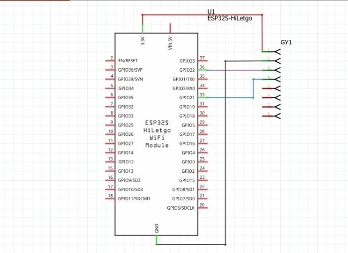
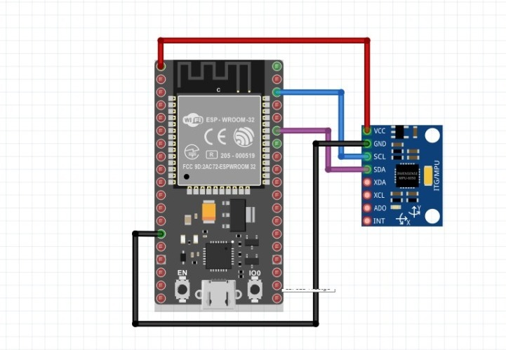

# Teste com Arduino
 Teste conexão arduino.  
 Chegou-se ao objetivo principal do projeto, o arduino placa ESP32 e acelerometro MPU6050 conseguem-se conectar na internet via wifi e tem seus dados capturados e tratados por meio do próprio.  

## Circuito usado:
  

   

    Direitos reservados a João Guilherme

